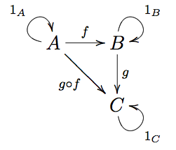
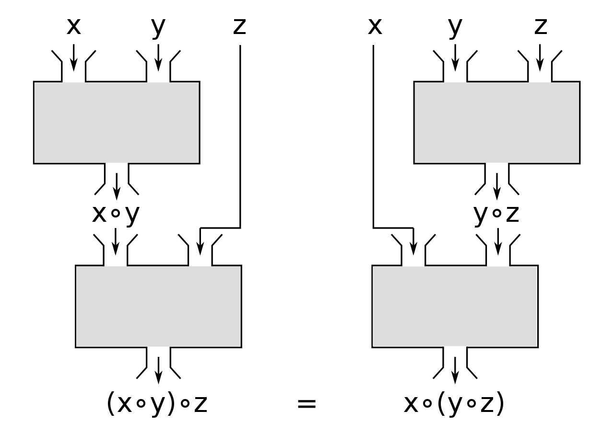

# The scarriness of Functors, Monoids and Monads

The world of programming is a complex thing nowadays. There is so many libraries, so many frameworks, so many practices and implementations. This requires a way to deal with all this complexity that's piled up in each and every ptoject over the years. Now, we need to support those project for at least couple of years, even tens of years afterwards, right? And we want not to just deal with legacy code, but to actually have it up to date, have it clean and easy to understand.

The OOP-way of dealing with complexity is to encapsulate the details, extend with polymorhism, and reuse with inheritance. Lately, sbstraction was introduced to the family. Each of those approaches is not perfect and has it's own flaws. Tough encapsulation hides the unnecessary  implementation details, they still require a hard reference to the dependencies. Polymorphism is usually tighed up with inheritance and gets very complex when trying to build inherit more then one type (the diamond problem) and is not very explicit. Abstraction actually helps, but now we have tons and tons of interfaces (or any other type of sbsract definitions). For further reading I suggest a blog post on Medium called ["Object-Oriented Programming — The Trillion Dollar Disaster"](https://medium.com/better-programming/object-oriented-programming-the-trillion-dollar-disaster-92a4b666c7c7) by Ilya Suzdalnitski.

In functional programming we deal with complexity by combining little pieces toghether. Those pieces are actually functions. And we want them to be simple, decoupled and easy to undnerstand, so that we have a set of building blocks which can be used and combined in different ways. Like when we're building a house with bricks - small building blocks that help us to create all those different and unique houses that suit our needs.

## Category

In chapter [Functions](../tp-functions/README.md) it was mentioned that we have two things - data and functions to process the data. If we were to take all the types of data, define transformations over them and represent it visually, we'd result in sommething like this:



A set of types `A`, `B` and `C` and relations (arrows) between them is actually called [category](https://en.wikipedia.org/wiki/Category_(mathematics)) in mathematics.

Functions `f` and `g` define a transformattion from type `A` to type `B` and from `B` to `C` respectivly. A transformation from `A` to `C` can be defined as a combination of funtions - `f o g`. We can combine those functions because output type of function `f` matches the input type of function `g`.

Here functions `f` and `g` are called `morphisms`. In other words, `morphism` is a function that defines a map from object `A` to object `B`.

Now, how do we combine functions in programming? Let's look at the example:


```C#
let fromStringToFloat (value: string) = float value
let fromtFloatToInt (value: float) = int value
let fromoIntToBool (value: int) = value % 2 = 0
```

We declared two functions - one that converts from string to an actual number and the other rounds the floating point number to an integer. Now in order to combine tose two we can do the follwing:


```C#
let fromoStringToBool (value: string) = fromoIntToBool(fromtFloatToInt(fromStringToFloat(value)))
let isEven = fromoStringToBool "4.07"
printfn "Is Even: %A" isEven
```

    Is Even: true
    


<null>


A category has to support two properties - compose arrows (functions) associatively and the have an identity arrow (function). Let's have a deeper look.

### Associativity

Associativity is a property of some binary operations. Within an expression containing two or more occurrences in a row of the same associative operator, the order in which the operations are performed does not matter as long as the sequence of the operands is not changed.

```
2 + (3 + 4) = (2 + 3) + 4
```

Having the following functions:

```
f: a -> b
g: b -> c
h: c -> d
```

The following rules should apply:

```
f o (g o h) = (f o g) o h
```

Here is some proof in form of actual code.


```C#
let f: string -> float = fun (a: string) -> float a
let g: float -> int = fun (b: float) -> int b
let h: int -> bool = fun (c: int) -> c % 2 = 0

let (>>=) f g = fun a -> g(f(a))

let left = f >>= (g >>= h)
let right = (f >>= g) >>= h

printfn "Left: %b" (left "4.07")
printfn "Right: %b" (right "4.07")
```

    Left: true
    Right: true
    


<null>


Here are the visual representation of `associativity`:



In previous example, nesting the function calls is not a very good way to combine functions. With a growing number of functions to combine, we will get what is known as "pyramid of doom". Combining function like this is one way to do it, but it requires to explicitly define the input parameter types. But good news - we can refactor this code into a more beautiful one!In previous example, nesting the function calls is not a very good way to combine functions. With a growing number of functions to combine, we will get what is known as "pyramid of doom". Combining function like this is one way to do it, but it requires to explicitly define the input parameter types. But good news - we can refactor this code into a more beautiful one!


```C#
let fromStringToFloat value = float value
let fromtFloatToInt value = int value
let fromoIntToBool value = value % 2 = 0
let fromoStringToBool = fromStringToFloat >> fromtFloatToInt >> fromoIntToBool
let isEven = fromoStringToBool "4.07"
printfn "Is Even: %b" isEven
```

    Is Even: true
    


<null>


Notice, that we used the `>>` operator. This is a built-in function composition operator. It allows to create a new function by composing two or more functions. In order to do this, each function that takes and input from previous one, has to have exactly one input parameter and the retuurn type has to match the input type of the following function.

### Identity

Identity function is a function for any given object of a certain type will return the same object. Here is a mathematical definition:
```
id: a -> a
```

Here is some code to prove this:


```C#
let id: 'a -> 'a = fun (a: 'a) -> a

printfn "Identity of 4.07 is %A" (id 4.07)
printfn "Identity of true is %A" (id true)
printfn "Identity of \"Hello World!\" is %A" (id "Hello World!")
```

    Identity of 4.07 is 4.07
    Identity of true is true
    Identity of "Hello World!" is "Hello World!"
    


<null>


## Functor

Let's define another category called `Maybe`.


```C#
type Maybe<'a> =
    | Some of 'a
    | None

printfn "%A" (None)
printfn "%A" (Some 5)
printfn "%A" (Some 4.07)
printfn "%A" (Some "Hello World!")
```

    None
    Some 5
    Some 4.07
    Some "Hello World!"
    


<null>


### Associativity 

We have defined a set. Now we need to satify the `associativity` rule and `identity` rule.


```C#
let bind a =
    Some a

let map func a = 
    match a with
    | Some value -> Some (func value)
    | None -> None
    
let (>=>) f1 f2 = fun a -> f1 (f2 a)

let value5 = bind 5
let add2 = fun a -> a + 2
let add4 = fun b -> b + 4

let left = map (add2 >> add4)
let right = (map add2) >=> (map add4)

printfn "Left: %A" (left value5) 
printfn "Right: %A" (right value5)
```

    Left: Some 11
    Right: Some 11
    


<null>


### Identity 


```C#
let bind a =
    Some a
    
let map func a = 
    match a with
    | Some value -> Some (func value)
    | None -> None

let id: 'a -> 'a = fun (a: 'a) -> a

printfn "Identity of 4.07 is %A" (map id (bind 4.07))
printfn "Identity of true is %A" (map id (bind true))
printfn "Identity of \"Hello World!\" is %A" (map id (bind "Hello World!"))
```

    Identity of 4.07 is Some 4.07
    Identity of true is Some true
    Identity of "Hello World!" is Some "Hello World!"
    


<null>


Now that we have two categories, we need a way to go from one to another. This transformation between two categories is called a `functor`. In other words, `functor` is something that defines a `map` from category `A` category to category `B`.

## Monoid


```C#

```

## Resources

- [Object-Oriented Programming — The Trillion Dollar Disaster](https://medium.com/better-programming/object-oriented-programming-the-trillion-dollar-disaster-92a4b666c7c7)
- [Category (mathematics)](https://en.wikipedia.org/wiki/Category_(mathematics))
- [Associativity](https://en.wikipedia.org/wiki/Associative_property)
- [A Fistful of Monads](http://learnyouahaskell.com/a-fistful-of-monads)
- [Functors, Applicative Functors and Monoids](http://learnyouahaskell.com/functors-applicative-functors-and-monoids)
- [For a Few Monads More](http://learnyouahaskell.com/for-a-few-monads-more)
- [Brian Beckman: Don't fear the Monad](https://channel9.msdn.com/Shows/Going+Deep/Brian-Beckman-Dont-fear-the-Monads)
- [What the Functor?](https://www.matthewgerstman.com/tech/what-the-functor/)
- [Your easy guide to Monads, Applicatives, & Functors](https://medium.com/@lettier/your-easy-guide-to-monads-applicatives-functors-862048d61610)
- [Explaining monads](http://www.ouarzy.com/2017/09/27/explaining-monads/)
- [Category Theory for Programmers: The Preface](https://bartoszmilewski.com/2014/10/28/category-theory-for-programmers-the-preface/)
- [IO monad: which, why and how](https://kubuszok.com/2019/io-monad-which-why-and-how/)
- [From Haskell to F#](https://giuliohome.wordpress.com/2019/04/08/from-haskell-to-f/)
- [From design patterns to category theory](https://blog.ploeh.dk/2017/10/04/from-design-patterns-to-category-theory/)
- [Monads explained in C#](https://mikhail.io/2016/01/monads-explained-in-csharp/)
- [Monads explained in C# (again)](https://mikhail.io/2018/07/monads-explained-in-csharp-again/)
- [Introduction to Functors in C#](https://medium.com/@dimpapadim3/monads-in-oop-with-c-a4ec11f1f9d9)
- [Monoids in C#](https://medium.com/@dimpapadim3/monoids-in-oop-with-c-42060d3495a7)
- [Monads for object oriented programming with C#](https://medium.com/@dimpapadim3/monads-in-oop-with-c-a4ec11f1f9d9)
- [Functor, Applicative, and Why](https://medium.com/axiomzenteam/functor-applicative-and-why-8a08f1048d3d)
- [Option, Either, State, and IO: Imperative programming in a functional world](https://medium.com/disney-streaming/option-either-state-and-io-imperative-programming-in-a-functional-world-8e176049af81)


```C#

```
